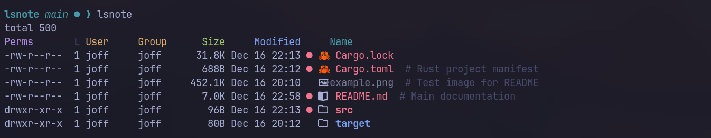

```
 _                 _
| |___ _ __   ___ | |_ ___
| / __| '_ \ / _ \| __/ _ \
| \__ \ | | | (_) | ||  __/
|_|___/_| |_|\___/ \__\___|
```

> `ls` with notes — because sometimes files need context



A modern `ls` replacement with **file notes**, **emoji icons**, **git integration**, and **colored column headers**. No nerd fonts required.

## Why lsnote?

```bash
# Regular ls
$ ls
Cargo.lock  Cargo.toml  README.md  src  target

# lsnote - detailed view with colored headers by default
$ lsnote
Perms       L User     Group      Size     Modified     Name
-rw-r--r--  1 user     user      26.8K Dec 16 20:10   🦀 Cargo.lock
-rw-r--r--  1 user     user       637B Dec 16 20:10   🦀 Cargo.toml  # Rust manifest
-rw-r--r--  1 user     user       5.5K Dec 16 20:10   📖 README.md
drwxr-xr-x  1 user     user        96B Dec 16 20:12 ● 📁 src
drwxr-xr-x  1 user     user        80B Dec 16 20:12   📁 target
```

**What you get:**
- **Detailed view by default** — Permissions, size, dates, and colored headers
- **Human-readable sizes** — `26.8K` instead of `27464`
- **Notes** — Add context to any file (`# Rust manifest` above)
- **Icons** — Instant visual recognition by file type
- **Git status** — See what's modified (●), staged (◐), or untracked (?) at a glance
- **Tree view** — Explore nested directories beautifully
- **Copy to clipboard** — Share project structure with `-c` flag (works on Wayland & X11)

## Installation

### Cargo (recommended)

```bash
cargo install lsnote
```

### Homebrew

```bash
brew tap jofftiquez/tap
brew install lsnote
```

### From source

```bash
git clone https://github.com/jofftiquez/lsnote.git
cd lsnote
cargo build --release
cp target/release/lsnote ~/.local/bin/
```

### Pre-built binaries

Download from [GitHub Releases](https://github.com/jofftiquez/lsnote/releases) for:
- macOS (Intel & Apple Silicon)
- Linux (x64 & ARM64)

## Quick Start

```bash
# Basic listing
lsnote

# Add a note to remember what a file is for
lsnote -s config.yaml "Production database settings - DO NOT COMMIT"

# View your project as a tree
lsnote -t
```

## Features

### File Notes

Attach persistent notes to any file or directory:

```bash
lsnote -s secrets.env "API keys for staging"
lsnote -s src/legacy/ "Deprecated - migrate to v2 by Q2"
```

Notes appear inline when listing:

```
  📄 secrets.env      # API keys for staging
● 📁 src/legacy/      # Deprecated - migrate to v2 by Q2
```

Manage notes:
```bash
lsnote -s FILE "note"    # Set note
lsnote -g FILE           # Get note
lsnote -r FILE           # Remove note
```

### Git Integration

Git status is shown automatically — no extra commands needed:

```
◐ 🦀 lib.rs          # Staged
● 🦀 main.rs         # Modified
? 📄 temp.txt        # Untracked
  📁 vendor/         # Clean
```

| Symbol | Meaning | Color |
|--------|---------|-------|
| ● | Modified | Red |
| ◐ | Staged | Green |
| ? | Untracked | Yellow |

Directories show the highest-priority status of their contents.

### Emoji Icons

Recognize file types instantly — works in any terminal:

| Type | Icon | Examples |
|------|------|----------|
| Rust | 🦀 | `.rs`, `Cargo.toml` |
| Python | 🐍 | `.py` |
| JavaScript | 🟨 | `.js`, `.jsx` |
| TypeScript | 🔷 | `.ts`, `.tsx` |
| Go | 🐹 | `.go` |
| Docker | 🐳 | `Dockerfile` |
| Config | ⚙️ | `.toml`, `.yaml`, `.json` |
| Docs | 📝 | `.md` |
| Images | 🖼️ | `.png`, `.jpg`, `.svg` |
| And many more... | | |

### Tree View

Visualize your project structure:

```bash
$ lsnote -t src
📁 src
├── 🦀 config.rs
├── 🦀 display.rs
├── 🦀 git.rs
├── 🦀 icons.rs
├── 🦀 main.rs
└── 🦀 notes.rs
```

### Long Format (Default)

The detailed view with permissions, size, dates, and colored headers is shown by default:

```bash
$ lsnote
Perms       L User     Group      Size     Modified     Name
drwxr-xr-x  1 user     user       256B Dec 16 09:34   📁 src
-rw-r--r--  1 user     user       3.5K Dec 16 09:34   🦀 main.rs  # Entry point
```

Use `-S` for a compact short listing:

```bash
$ lsnote -S
  🦀 Cargo.lock
  🦀 Cargo.toml
● 📁 src
```

Use `-B` to show raw byte sizes instead of human-readable:

```bash
$ lsnote -B
Perms       L User     Group        Size     Modified     Name
-rw-r--r--  1 user     user        27464 Dec 16 09:34   🦀 Cargo.lock
```

### Copy to Clipboard

Copy any view to clipboard — perfect for documentation, chat, or AI prompts:

```bash
# Copy current listing
$ lsnote -c
Perms       L User     Group      Size     Modified     Name
-rw-r--r--  1 user     user       3.5K Dec 16 09:34   🦀 main.rs
Copied to clipboard!

# Copy tree view
$ lsnote -ct src
📁 src
├── 🦀 config.rs
└── 🦀 main.rs
Copied to clipboard!

# Copy short format
$ lsnote -cS
  🦀 Cargo.lock
  🦀 Cargo.toml
Copied to clipboard!
```

Works on **Linux** (Wayland & X11), **macOS**, and **Windows**. No external clipboard tools required.

Combine `-c` with any other flags (`-t`, `-S`, `-a`, `-B`, etc.).

## Usage

```bash
lsnote [OPTIONS] [PATH]

Options:
  -a, --all              Show hidden files
  -S, --short            Short listing (disable detailed view)
  -B, --bytes            Show raw byte sizes (disable human-readable)
  -t, --tree             Tree view
  -c, --copy             Copy output to clipboard
  -s, --set FILE NOTE    Set a note
  -g, --get FILE         Get a note
  -r, --remove FILE      Remove a note
      --no-git           Disable git status indicators
      --no-icons         Disable icons
      --no-header        Hide column headers
      --init-config      Generate config file
  -h, --help             Print help
  -V, --version          Print version
```

**Defaults:** Long format with human-readable sizes and colored headers are enabled by default.

## Configuration

Generate a config file:

```bash
lsnote --init-config
```

Edit `~/.lsnote/config`:

```ini
# Custom icons
icon.directory = 📁
icon.ext.rs = 🦀
icon.ext.py = 🐍
icon.name.Dockerfile = 🐳

# Colors
color.directory = blue
color.git_modified = red
color.git_staged = green
color.git_untracked = yellow

# Git symbols
git.modified = ●
git.staged = ◐
git.untracked = ?
```

## Tips

### Replace `ls` with `lsnote`

Add an alias to your shell config:

**Bash** (`~/.bashrc`):
```bash
alias ls='lsnote'
alias ll='lsnote'           # Already long format by default
alias la='lsnote -a'        # Show hidden files
alias lt='lsnote -t'        # Tree view
alias lss='lsnote -S'       # Short format
```

**Zsh** (`~/.zshrc`):
```zsh
alias ls='lsnote'
alias ll='lsnote'
alias la='lsnote -a'
alias lt='lsnote -t'
alias lss='lsnote -S'
```

**Fish** (`~/.config/fish/config.fish`):
```fish
alias ls 'lsnote'
alias ll 'lsnote'
alias la 'lsnote -a'
alias lt 'lsnote -t'
alias lss 'lsnote -S'
```

Then reload your shell:
```bash
source ~/.bashrc  # or ~/.zshrc
```

## Data Storage

- **Notes**: `~/.lsnote/notes`
- **Config**: `~/.lsnote/config`

## License

MIT

---

Made with ❤️ by [@jofftiquez](https://github.com/jofftiquez)
